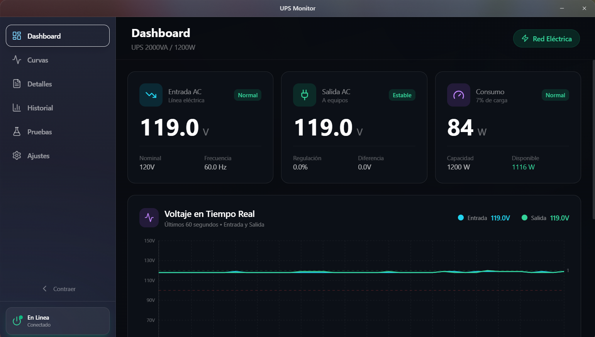
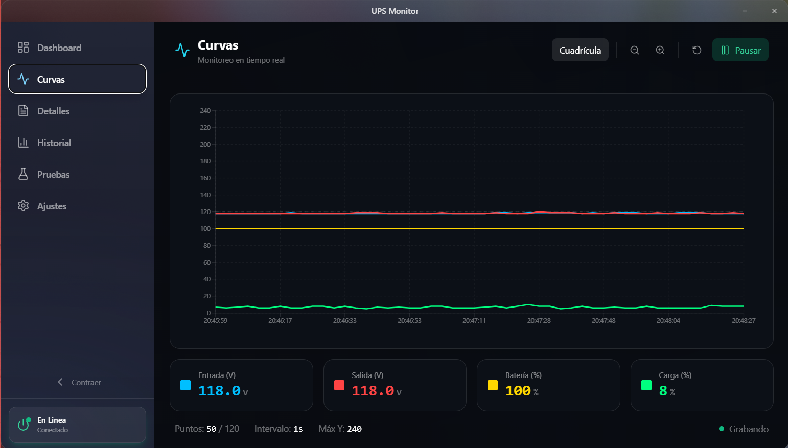

# UPS Monitor

Monitor de UPS para Windows, construido con **Tauri + Rust + React**, enfocado en monitoreo en tiempo real, alertas y operacion en segundo plano.


## Capturas

### Dashboard

<p align="center">
  
</p>

### Curvas

<p align="center">
  
</p>

## Caracteristicas

- Dashboard de voltajes y estado en tiempo real (entrada, salida, carga, frecuencia, temperatura).
- Curvas en vivo para seguimiento electrico.
- Historial de eventos y datos.
- Alertas con sonido, notificacion y popup urgente.
- Operacion en segundo plano con icono de bandeja (tray).
- Modo **Solo monitor** para desactivar automatizaciones.

## Stack y Lenguajes

| Capa | Tecnologia |
|---|---|
| Backend | Rust + Tauri v2 |
| Frontend | React + TypeScript + Vite |
| UI | CSS (Tailwind utilities + estilos custom) |
| Comunicacion | Tauri IPC (`invoke`, eventos) |
| Graficos | Recharts |

**Lenguajes principales:** Rust, TypeScript, CSS, HTML.

## Matriz de Versiones

| Componente | Version |
|---|---|
| Rust toolchain | `1.93.0` |
| Tauri core (Rust) | `2.10.x` |
| Tauri CLI (JS) | `2.10.x` |
| React | `19.2.x` |
| TypeScript | `5.9.x` |
| Vite | `7.3.x` |
| Node.js recomendado | `20+` |

## Compatibilidad UPS (actual)

Actualmente esta version esta enfocada en:

- **Marca:** Hikvision
- **Modelo:** UPS USB Mon (2000VA)
- **Tipo:** USB HID
- **Capacidad:** 2000VA / 1200W
- **VID/PID:** `0x0925` / `0x1234`

> Se agregara compatibilidad con mas marcas y modelos de UPS en futuras versiones.

## Requisitos

- Windows 10/11
- Rust (`stable-x86_64-pc-windows-msvc`)
- Node.js + npm
- Microsoft Edge WebView2 Runtime
- MSVC Build Tools / Visual Studio con C++ Desktop tools

## Instalacion y Desarrollo

```bash
npm install
npm run start
```

## Build de Produccion

```bash
npm run build
npm run tauri -- build
```

## Scripts Disponibles

```bash
npm run dev         # Vite dev server
npm run start       # Tauri dev (frontend + backend)
npm run build       # Build frontend
npm run tauri -- build
npm run test:run
```

## Estructura del Proyecto

```text
src/          # Frontend React/TypeScript
src-tauri/    # Backend Rust + configuracion Tauri
assets/       # Recursos (sonidos, iconos)
docs/images/  # Capturas del README
tests/        # Tests frontend (Vitest)
```

## Roadmap

- [x] Monitoreo base en tiempo real.
- [x] Alertas y operacion en segundo plano.
- [x] Modo Solo monitor.
- [ ] Compatibilidad con mas modelos UPS.
- [ ] Exportacion avanzada de historial.
- [ ] Paquetes firmados para distribucion.

## Licencia

Este proyecto esta bajo licencia **MIT**.
